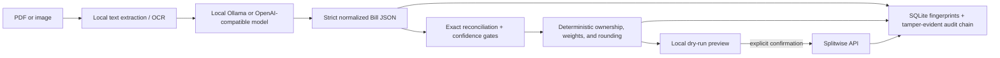

# WaySplit

WaySplit is a local-first, self-hosted mobile statement splitter. A locally
running language or vision model extracts a carrier-neutral bill; deterministic
code then reconciles every cent, applies household rules, prevents duplicates,
and prepares a Splitwise expense for explicit approval.

Open the browser app at `http://127.0.0.1:9876`. There is no cloud-model
fallback, no analytics, and no automatic external posting.

> **Release status:** `v0.1.5` is an operational, production-minded alpha for a
> single operator on a trusted Mac or Linux host. The full browser-to-Splitwise
> flow ships, but model extraction can still be wrong even when totals match.
> Review every charge and allocation before posting.

> **Parser isolation is not a sandbox.** PDF rendering and OCR run in a separate,
> resource-bounded process with a scrubbed environment and closed inherited file
> descriptors. In this alpha, that child still runs as the same OS account and can
> potentially reach files and networks available to that account if a native parser
> is exploited. Docker narrows mounts and privileges but does not create a separate
> security principal for the parser. Do not treat WaySplit as safe for anonymous or
> adversarial uploads; see the [threat model](docs/THREAT_MODEL.md).

## Start here (no command-line knowledge needed)

On a Mac, install and open [Docker Desktop](https://www.docker.com/products/docker-desktop/),
then double-click `start.command` in this folder. On Linux, open a terminal in
this folder and run `./start.sh`. The launcher downloads the verified WaySplit
image, starts the local service, and opens `http://127.0.0.1:9876` for you.
There is no password or copy-token step: this release is designed for a
trusted computer and binds to local loopback by default. Then follow the five
numbered sections in the browser:

1. Choose a local model and run the fictional readiness test.
2. Add the people on the bill, choose the payer, and save the household.
3. Drop in the monthly PDF or image and choose **Extract statement**.
4. Read every charge and wait for both reconciliation checks to pass.
5. Build the preview. Only if you choose Splitwise, connect it and confirm the
   exact expense shown on screen.

The first four steps never contact Splitwise. To stop the local service, run
`docker compose stop waysplit`. To start it again, double-click `start.command`
or run `./start.sh`.

## The trust contract

- Statement processing is local. Version `0.1.1` rejects remote model mode;
  configured endpoints must resolve through an approved local/container name.
- The model may extract and classify facts. It never performs authoritative
  money arithmetic, chooses recipients, receives a Splitwise token, or posts.
- Posting requires exact cent-for-cent reconciliation of both itemized current
  charges and the signed statement balance equation. There is no posting
  tolerance.
- Low-confidence charges, missing evidence, unresolved line owners, incomplete
  destination IDs, duplicate statements, and damaged local integrity all block
  posting.
- Every post requires a dry-run preview, a digest-bound 15-minute confirmation,
  two human acknowledgements, and a single-use confirmation token.
- A Splitwise timeout after request transmission is recorded as ambiguous and
  can never be retried blindly.
- Raw statements are deleted after extraction by default. Normalized statement
  data and minimized audit records remain in a permission-restricted SQLite
  database.
- Secrets, real statements, databases, scan reports, and local configuration are
  excluded from Git.
- Document tooling runs in a disposable child with cumulative text/image/pixel
  budgets, a wall timeout, CPU limits, Linux memory/no-new-privileges controls,
  minimal OCR-only environment variables, and non-executable bounded JSON IPC.
  These controls limit faults and leakage but do not provide filesystem or network
  containment against a compromised same-UID child.

## How it works



Carrier names and page layouts are metadata, not parser dispatch keys. Every
statement crosses the same versioned [`NormalizedBill`](src/waysplit/domain/models.py)
boundary. Future carrier adapters may improve ingestion or validation, but they
cannot allocate money or weaken a global safety gate.

## Quick start with Docker Compose

Prerequisites:

- Docker Engine or Docker Desktop with Compose;
- a local Ollama or OpenAI-compatible model server, unless using the optional
  bundled Ollama service; and
- enough RAM for the model you select.

```bash
git clone https://github.com/Dennis-Gireesh/llm-way-split.git
cd llm-way-split
docker compose up --build --detach waysplit
```

Open <http://127.0.0.1:9876> directly. There is no browser unlock screen. The
first workspace screen discovers configured local model
endpoints. Choose a model and run the statement-free readiness test before an
upload is enabled.

WaySplit checks host Ollama on port `11434`, a host OpenAI-compatible endpoint
on port `8080`, and the optional Compose Ollama service. The application itself
uses port `9876`, so it does not collide with an existing model server on
`8080`.

### Optional bundled Ollama

Start the internal-only Ollama service with:

```bash
docker compose --profile ollama up --build --detach
```

Models are deliberately not bundled or downloaded without consent. For
image-only statements, a vision model is required. For example, the official
Ollama library currently offers `qwen3-vl:8b` as a 6.1 GB text-and-image model:

```bash
docker compose exec ollama ollama pull qwen3-vl:8b
```

That example is not a guarantee or endorsement. Hardware requirements, model
licenses, and extraction quality vary. WaySplit displays available Ollama model
metadata and runs its own synthetic schema/reconciliation check; only models
that pass are selectable for a statement. Review the model's license before use.

Stop the application without deleting persistent data:

```bash
docker compose --profile ollama down
```

## Browser workflow

1. **Choose a local reader.** WaySplit discovers only configured endpoints and
   tests the selected model with a fictional statement. Discovery never sends a
   real document.
2. **Define the household.** Add stable participant IDs, weights, line owners,
   payer, and optional Splitwise mappings. Destination user IDs must be unique.
3. **Upload a statement.** PDFs, PNG, JPEG, TIFF, and WebP are accepted within
   configured size/page/resource limits. Native PDF text is preferred; local OCR
   and page rendering are fallbacks.
4. **Review extraction.** Inspect totals, evidence, confidence, categories,
   scopes, and owners. Expert JSON correction is strict-schema validated and
   invalidates any earlier preview.
5. **Build a dry run.** Exact decimal allocation and largest-remainder rounding
   produce participant shares that sum exactly to current charges.
6. **Approve or keep local.** The preview remains local until a one-time
   confirmation is issued and both acknowledgements are checked.
7. **Verify the destination result.** WaySplit reads the created expense back.
   A verified, unverified, failed, or ambiguous result is persisted explicitly.
   Only an app-created expense with a recorded remote ID can be rolled back.

The browser can optionally use a Splitwise token once to load group/member names
and IDs. A pasted token exists only in the current tab's JavaScript memory; it is
not written to browser storage, SQLite, the audit chain, or a response. Manual ID
entry remains available.

## What leaves the host

| Action | Network destination | Data sent |
| --- | --- | --- |
| Open the app | None | Nothing |
| Discover/probe a local model | Configured model endpoint | Model-list requests, then one fictional statement |
| Extract a statement | Selected model endpoint | Extracted text and, only when needed, locally rendered page images |
| Load Splitwise account choices | Splitwise | Bearer token; Splitwise returns current user/group/member data, which WaySplit minimizes to names and numeric IDs |
| Confirm a Splitwise post | Splitwise | Description, date, currency, group ID, total current charges, paid/owed shares, participant IDs, and a WaySplit correlation reference |
| Roll back | Splitwise | Recorded app-created expense ID and bearer token |

Remote model mode is not supported in `v0.1.0`; configuration that enables it is
rejected. “OpenAI-compatible” describes the API shape of a local endpoint, not a
cloud fallback or privacy guarantee.

## Splitwise setup and terms

WaySplit uses the official [Splitwise API](https://dev.splitwise.com/) and a
personal access token supplied at run time. Before connecting or posting, the
browser requires acknowledgement of the provider's current API terms. Those
terms can change and currently include consent, privacy, rate/access-limit, and
commercial-use constraints. The self-serve API must not be assumed to authorize
a commercial or fee-based service.

The application sends the deterministic split of **current charges**, not the
statement's amount due or previous balance. It does not send the original PDF,
OCR text, account identifier, billing address, evidence excerpts, or model
output to Splitwise.

Splitwise does not document an idempotency key for expense creation. WaySplit
therefore never automatically retries a transmitted request whose result is
unknown. Search the group using the recorded `WS-…` reference before taking any
manual action.

## Configuration

Safe defaults are in [`.env.example`](.env.example) and
[`config.example.yaml`](config.example.yaml). Environment variables override
YAML. Common settings are:

| Variable | Default | Purpose |
| --- | --- | --- |
| `WAYSPLIT_HOST` | `127.0.0.1` | Loopback bind outside Docker |
| `WAYSPLIT_PORT` | `9876` | Browser service port |
| `WAYSPLIT_DATA_DIR` | `./data` | SQLite and temporary upload location |
| `WAYSPLIT_MODEL_ENDPOINTS` | local well-known endpoints | Comma-separated approved model APIs |
| `WAYSPLIT_MODEL_TIMEOUT_SECONDS` | `300` | Model request timeout |
| `WAYSPLIT_RETAIN_SOURCE` | `false` | Keep the original statement after extraction |
| `WAYSPLIT_MAX_UPLOAD_MIB` | `25` | Upload byte limit |
| `WAYSPLIT_MAX_PAGES` | `60` | PDF page limit |
| `WAYSPLIT_RECONCILIATION_TOLERANCE` | `0.00` | Must remain zero for posting |
| `WAYSPLIT_MINIMUM_EXTRACTION_CONFIDENCE` | `0.80` | Per-charge confidence gate |
| `WAYSPLIT_REQUIRE_CHARGE_EVIDENCE` | `true` | Require evidence on every charge |
| `WAYSPLIT_ALLOWED_ORIGINS` | loopback origins | Browser origin allowlist |

The container runs as UID/GID `10001`, binds only to host loopback, drops all
Linux capabilities, uses a read-only root filesystem, and writes only to its
persistent `/data` volume and bounded temporary filesystem.

The parser child shares that UID, `/data` volume, and container network. On a
native installation it shares the operator account's filesystem permissions.
Environment/descriptor scrubbing, resource limits, and Linux `no_new_privs`
reduce exposure, but this alpha does not ship a seccomp policy, network namespace,
macOS Seatbelt profile, or separate parser user. Treat the boundary as crash and
resource isolation—not containment of arbitrary code execution.

Do not expose WaySplit directly to the Internet. Version `0.1.1` has no browser
login; origin validation and CSRF protection defend against cross-site requests,
not against a process or person that can reach the port. Keep it on loopback or
place it behind authenticated TLS before any non-loopback deployment.
Splitwise credentials are accepted only from the current browser tab/request
and cannot be configured server-side. If LAN access is required, place WaySplit
behind authenticated TLS and review the deployment boundary deliberately.

## Native installation

Python `3.12` and [`uv`](https://docs.astral.sh/uv/) are required. Tesseract must
also be installed locally if OCR fallback is needed.

```bash
uv sync --frozen --all-extras
uv run waysplit doctor
uv run waysplit serve
```

The CLI also provides `waysplit audit-verify` and `waysplit version`. It does
not expose a posting bypass.

`doctor`, `audit-verify`, and server startup open and initialize the database;
they are not read-only inspection commands. When pointed at the legacy
pre-release schema, they may apply the supported migration before producing a
diagnostic result. Make and verify a protected, database-consistent backup
before running a newer WaySplit binary. The migration also creates a verified
`waysplit.pre-schema-2.<timestamp>.sqlite3` safety copy beside the database, but
that same-disk copy does not replace an operator-controlled backup. See the
[upgrade procedure](docs/RELEASES_AND_ROLLBACK.md#operator-upgrade-procedure).

## Verification and release evidence

All direct Python dependencies are exactly pinned and the transitive Python
dependency resolution is locked in [`uv.lock`](uv.lock). Native libraries in
wheels and the container operating system are tracked separately in release
SBOMs and the [embedded-native record](docs/EMBEDDED_NATIVE_COMPONENTS.md).

```bash
make check
make test
make build
make scan
make sbom
```

CI runs formatting, lint, strict typing, tests, package/container builds,
CodeQL, secret/configuration/dependency scans, and image scans. Release tags
build multi-platform GHCR images plus signed per-platform provenance and
CycloneDX/SPDX SBOMs,
checksums, source/wheel artifacts, and an immutable image digest. See
[`docs/RELEASES_AND_ROLLBACK.md`](docs/RELEASES_AND_ROLLBACK.md) before an
upgrade or rollback.

The repository includes only project-authored synthetic fixtures. Regenerate
the fictional PDF with `uv run python scripts/generate_synthetic_pdf.py`; its
bytes are deterministic.

## Scope and limitations

Shipped in `v0.1.0`:

- end-to-end browser workflow on one Mac/Linux host;
- generic PDF/image ingestion, native text extraction, local OCR fallback, and
  local model/VLM extraction;
- versioned carrier-neutral schema, exact money engine, weighted/account and
  line-owner allocation, deterministic rounding, reconciliation, and duplicate
  gates;
- SQLite run state and a verifiable hash-linked audit record;
- Splitwise context lookup, dry run, explicit post, read-back verification,
  ambiguous-result lockout, and app-created expense rollback; and
- hardened Compose, pinned dependencies/images, CI, scans, SBOMs, release
  artifacts, threat model, privacy policy, and rollback documentation.

Not shipped in `v0.1.0`:

- WhatsApp publishing, email attachment ingestion, schedules, or unattended
  posting;
- in-app retry authorization after an ambiguous remote write; version `0.1.0`
  keeps that run locked even after the operator resolves the destination manually;
- multi-user accounts, role-based identity, password recovery, or Internet-facing deployment;
- carrier-specific core parsers or a guarantee for every carrier/layout;
- password-protected PDFs; or
- a guarantee that a plausible, reconciled model extraction is semantically
  correct.

## Security, privacy, and provenance

- [Security policy](SECURITY.md)
- [Threat model](docs/THREAT_MODEL.md)
- [Privacy boundary](docs/PRIVACY.md)
- [Architecture](docs/ARCHITECTURE.md)
- [Independent implementation and prior art](docs/PROVENANCE.md)
- [Embedded native components](docs/EMBEDDED_NATIVE_COMPONENTS.md)
- [Release and rollback](docs/RELEASES_AND_ROLLBACK.md)
- [Contributing](CONTRIBUTING.md)

WaySplit was independently implemented from requirements and public behavior.
No code, prompts, tests, fixtures, prose, layouts, or assets were copied from
the referenced bill-splitting repositories or `html-anything`. Repositories
without an applicable license were treated as behavioral references only. See
the provenance record for the exact boundary.

WaySplit is licensed under [Apache License 2.0](LICENSE). Dependencies, local
models, provider APIs, and trademarks retain their own licenses and terms.
Carrier and destination names are descriptive compatibility references and do
not imply endorsement.
