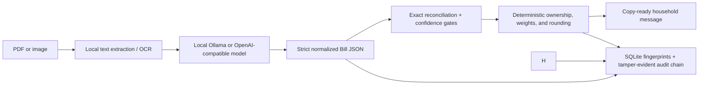

# WaySplit

WaySplit is a local-first, self-hosted mobile statement splitter. A locally
running language or vision model extracts a carrier-neutral bill; deterministic
code then reconciles every cent, applies household rules, prevents duplicates,
and prepares a copy-ready household summary for your household chat.

Open the browser app at `http://127.0.0.1:9876`. There is no cloud-model
fallback, no analytics, and no automatic sending.


## Start here (no command-line knowledge needed)

On a Mac, install and open [Docker Desktop](https://www.docker.com/products/docker-desktop/),
then double-click `start.command` in this folder. On Linux, open a terminal in
this folder and run `./start.sh`. The launcher downloads the verified WaySplit
image, starts the local service, and opens `http://127.0.0.1:9876` for you.
There is no password or copy-token step: this release is designed for a
trusted computer and binds to local loopback by default. Then follow the five
numbered sections in the browser:

1. Choose a local model and run the quick check.
2. Add the people on the bill and assign line owners.
3. Drop in the monthly PDF or image and choose **Extract statement**.
4. Review the bill and calculate the household shares.
5. Copy the formatted WhatsApp message.

All processing stays on this machine. To stop the local service, run
`docker compose stop waysplit`. To start it again, double-click `start.command`
or run `./start.sh`.

## What the app does

- Statement processing is local. Version `0.1.1` rejects remote model mode;
  configured endpoints must resolve through an approved local/container name.
- The model reads and classifies the statement. The app performs all money
  arithmetic and rounding deterministically.
- Every bill is checked before shares are shown. A mismatch is clearly explained
  so you can correct the extracted facts.
- Line charges go to the owner you choose. Shared charges follow the weights you
  set for each person.
- Raw statements are deleted after extraction by default. Normalized statement
  data and minimized audit records remain in a permission-restricted SQLite
  database.
- Secrets, real statements, databases, scan reports, and local configuration are
  excluded from Git.
- Document tooling runs in a disposable child with cumulative text/image/pixel
  budgets, a wall timeout, CPU limits, Linux memory/no-new-privileges controls,
  minimal OCR-only environment variables, and non-executable bounded JSON IPC.
  These controls limit faults and leakage but do not provide filesystem or network
  containment against a compromised same-UID child.

## How it works



Carrier names and page layouts are metadata, not parser dispatch keys. Every
statement crosses the same versioned [`NormalizedBill`](src/waysplit/domain/models.py)
boundary. Future carrier adapters may improve ingestion or validation, but they
cannot allocate money or weaken a global safety gate.

## Quick start with Docker Compose

Prerequisites:

- Docker Engine or Docker Desktop with Compose;
- a local Ollama or OpenAI-compatible model server, unless using the optional
  bundled Ollama service; and
- enough RAM for the model you select.

```bash
git clone https://github.com/Dennis-Gireesh/llm-way-split.git
cd llm-way-split
docker compose up --build --detach waysplit
```

Open <http://127.0.0.1:9876> directly. There is no browser unlock screen. The
first workspace screen discovers configured local model
endpoints. Choose a model and run the statement-free readiness test before an
upload is enabled.

WaySplit checks host Ollama on port `11434`, a host OpenAI-compatible endpoint
on port `8080`, and the optional Compose Ollama service. The application itself
uses port `9876`, so it does not collide with an existing model server on
`8080`.

### Optional bundled Ollama

Start the internal-only Ollama service with:

```bash
docker compose --profile ollama up --build --detach
```

Models are deliberately not bundled or downloaded without consent. For
image-only statements, a vision model is required. For example, the official
Ollama library currently offers `qwen3-vl:8b` as a 6.1 GB text-and-image model:

```bash
docker compose exec ollama ollama pull qwen3-vl:8b
```

That example is not a guarantee or endorsement. Hardware requirements, model
licenses, and extraction quality vary. WaySplit displays available Ollama model
metadata and runs its own synthetic schema/reconciliation check; only models
that pass are selectable for a statement. Review the model's license before use.

Stop the application without deleting persistent data:

```bash
docker compose --profile ollama down
```

## Browser workflow

1. **Choose a local reader.** WaySplit discovers only configured endpoints and
   tests the selected model with a fictional statement. Discovery never sends a
   real document.
2. **Define the household.** Add names, weights, and line owners.
3. **Upload a statement.** PDFs, PNG, JPEG, TIFF, and WebP are accepted within
   configured size/page/resource limits. Native PDF text is preferred; local OCR
   and page rendering are fallbacks.
4. **Review extraction.** Inspect totals, evidence, confidence, categories,
   scopes, and owners. Expert JSON correction is strict-schema validated and
   invalidates any earlier preview.
5. **Calculate the shares.** Exact decimal allocation and largest-remainder rounding
   produce participant shares that sum exactly to current charges.
6. **Copy the message.** WaySplit formats the billing period, total, and each
   person’s amount for your household chat. It never sends the message for you.

## What leaves the host

| Action | Network destination | Data sent |
| --- | --- | --- |
| Open the app | None | Nothing |
| Discover/probe a local model | Configured model endpoint | Model-list requests, then one fictional statement |
| Extract a statement | Selected model endpoint | Extracted text and, only when needed, locally rendered page images |
| Copy the household message | None | Nothing leaves this machine |

Remote model mode is not supported in `v0.1.0`; configuration that enables it is
rejected. “OpenAI-compatible” describes the API shape of a local endpoint, not a
cloud fallback or privacy guarantee.

## Configuration

Safe defaults are in [`.env.example`](.env.example) and
[`config.example.yaml`](config.example.yaml). Environment variables override
YAML. Common settings are:

| Variable | Default | Purpose |
| --- | --- | --- |
| `WAYSPLIT_HOST` | `127.0.0.1` | Loopback bind outside Docker |
| `WAYSPLIT_PORT` | `9876` | Browser service port |
| `WAYSPLIT_DATA_DIR` | `./data` | SQLite and temporary upload location |
| `WAYSPLIT_MODEL_ENDPOINTS` | local well-known endpoints | Comma-separated approved model APIs |
| `WAYSPLIT_MODEL_TIMEOUT_SECONDS` | `300` | Model request timeout |
| `WAYSPLIT_RETAIN_SOURCE` | `false` | Keep the original statement after extraction |
| `WAYSPLIT_MAX_UPLOAD_MIB` | `25` | Upload byte limit |
| `WAYSPLIT_MAX_PAGES` | `60` | PDF page limit |
| `WAYSPLIT_RECONCILIATION_TOLERANCE` | `0.00` | Bill check tolerance |
| `WAYSPLIT_MINIMUM_EXTRACTION_CONFIDENCE` | `0.80` | Per-charge confidence gate |
| `WAYSPLIT_REQUIRE_CHARGE_EVIDENCE` | `true` | Require evidence on every charge |
| `WAYSPLIT_ALLOWED_ORIGINS` | loopback origins | Browser origin allowlist |

The container runs as UID/GID `10001`, binds only to host loopback, drops all
Linux capabilities, uses a read-only root filesystem, and writes only to its
persistent `/data` volume and bounded temporary filesystem.

Keep WaySplit on the local computer. It is designed for one household on a
trusted Mac or Linux machine, not for an Internet-facing deployment.

## Native installation

Python `3.12` and [`uv`](https://docs.astral.sh/uv/) are required. Tesseract must
also be installed locally if OCR fallback is needed.

```bash
uv sync --frozen --all-extras
uv run waysplit doctor
uv run waysplit serve
```

The CLI also provides `waysplit version`.

## Maintenance

All direct Python dependencies are exactly pinned and the transitive Python
dependency resolution is locked in [`uv.lock`](uv.lock). Native libraries in
wheels and the container operating system are tracked separately in release
SBOMs and the [embedded-native record](docs/EMBEDDED_NATIVE_COMPONENTS.md).

```bash
make check
make test
make build
make scan
make sbom
```

CI runs formatting, lint, typing, tests, and dependency checks.

The repository includes only project-authored synthetic fixtures. Regenerate
the fictional PDF with `uv run python scripts/generate_synthetic_pdf.py`; its
bytes are deterministic.

## Scope

WaySplit reads mobile statements locally, checks the totals, allocates charges
to the household members you choose, and prepares a copy-ready message. It does
not send WhatsApp messages, connect to payment services, or upload statements to
the cloud.

## Security, privacy, and provenance

- [Security policy](SECURITY.md)
- [Threat model](docs/THREAT_MODEL.md)
- [Privacy boundary](docs/PRIVACY.md)
- [Architecture](docs/ARCHITECTURE.md)
- [Independent implementation and prior art](docs/PROVENANCE.md)
- [Embedded native components](docs/EMBEDDED_NATIVE_COMPONENTS.md)
- [Release and rollback](docs/RELEASES_AND_ROLLBACK.md)
- [Contributing](CONTRIBUTING.md)

WaySplit was independently implemented from requirements and public behavior.
No code, prompts, tests, fixtures, prose, layouts, or assets were copied from
the referenced bill-splitting repositories or `html-anything`. Repositories
without an applicable license were treated as behavioral references only. See
the provenance record for the exact boundary.

WaySplit is licensed under [Apache License 2.0](LICENSE). Dependencies, local
models, provider APIs, and trademarks retain their own licenses and terms.
Carrier and destination names are descriptive compatibility references and do
not imply endorsement.
